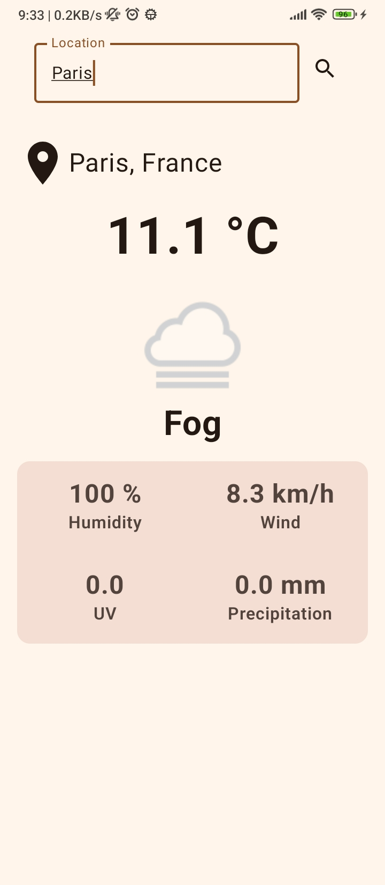

# Weatherly

Just a weather android app.

## API

- [WeatherAPI](https://www.weatherapi.com)

BASE_URL and API_KEY are changed in build.gradle.kts of the app.

## Libraries

- Jetpack Compose
- ViewModel
- LiveData
- Retrofit2
- Coil3

## Result

